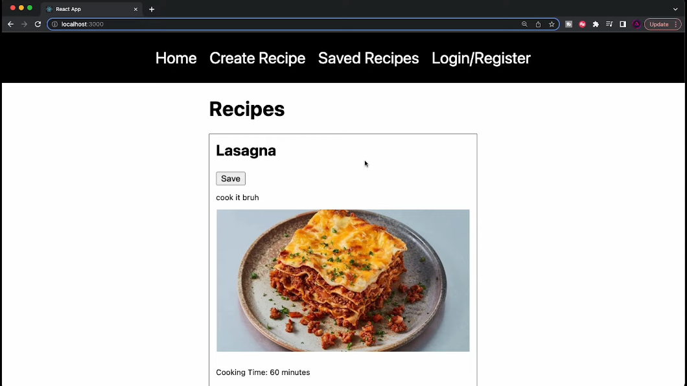
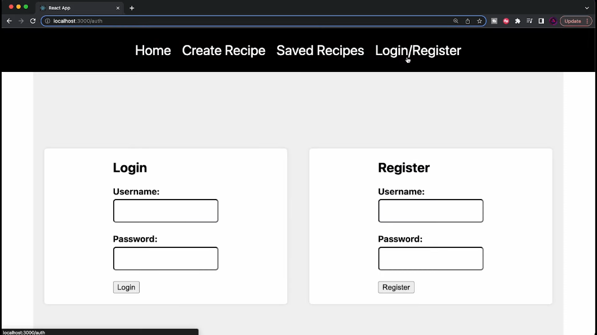
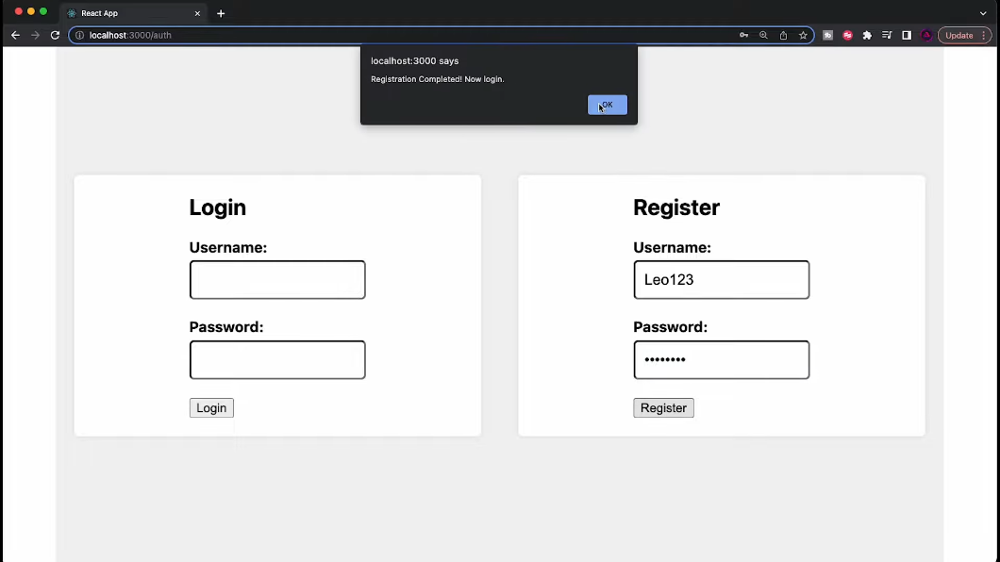
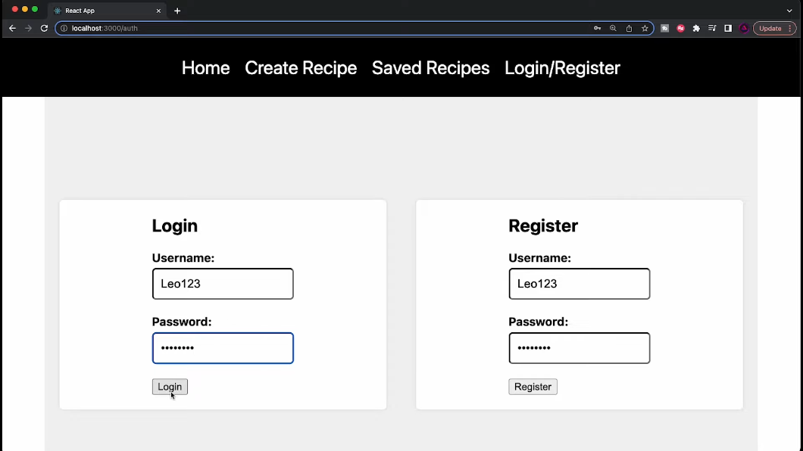
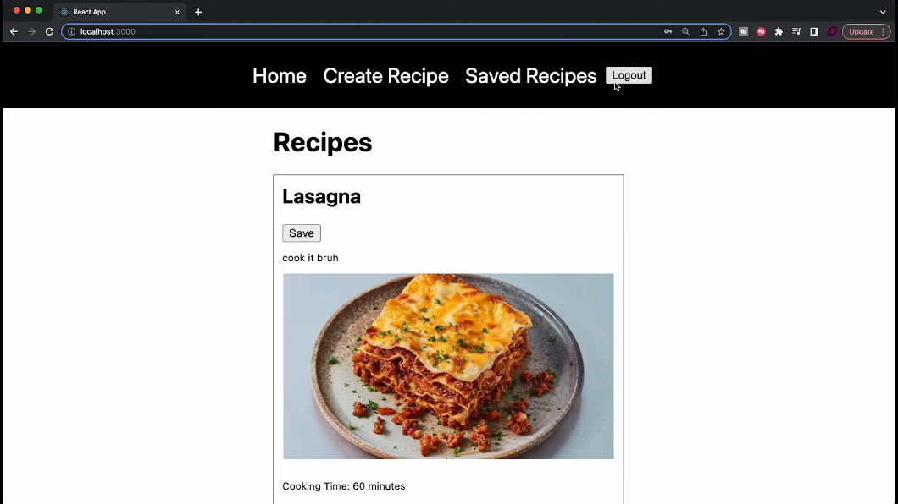
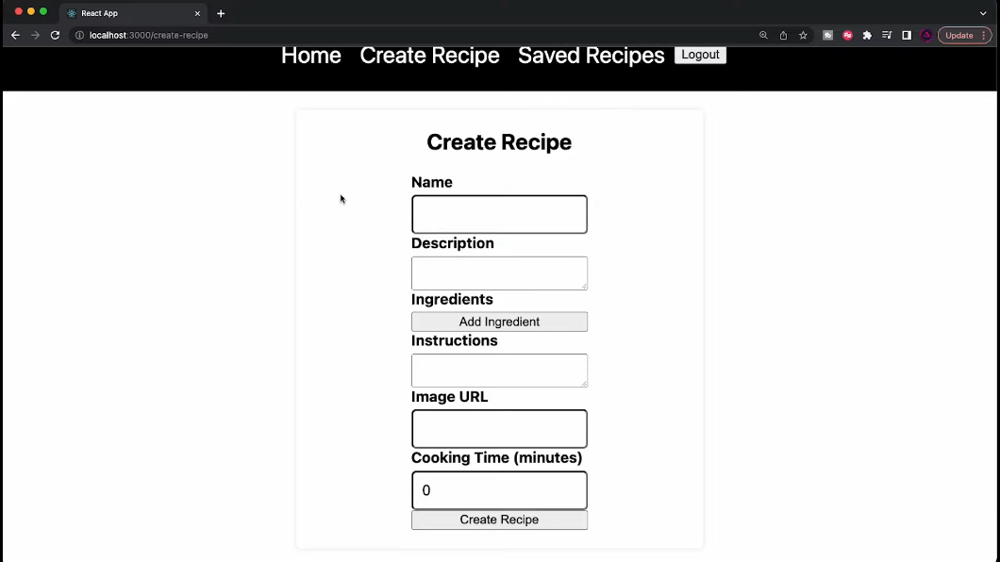
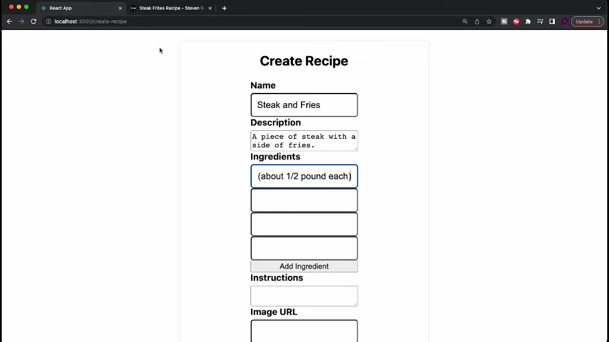
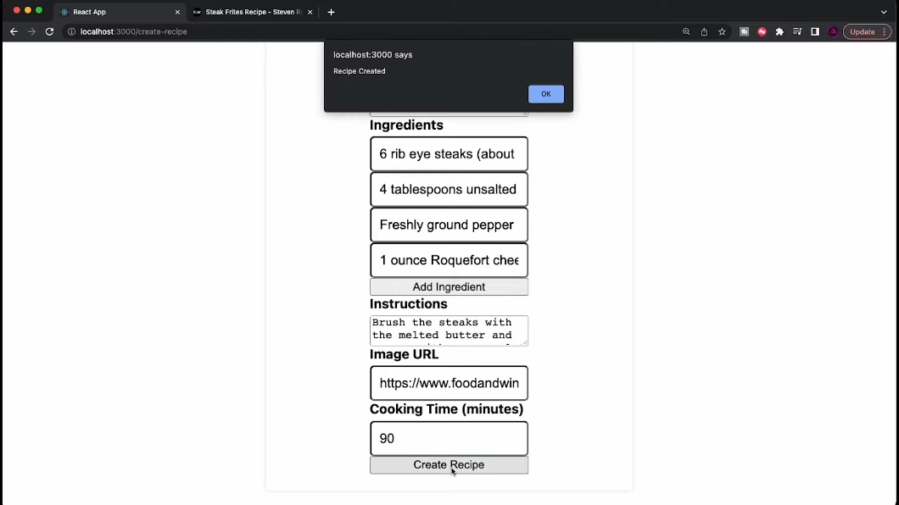
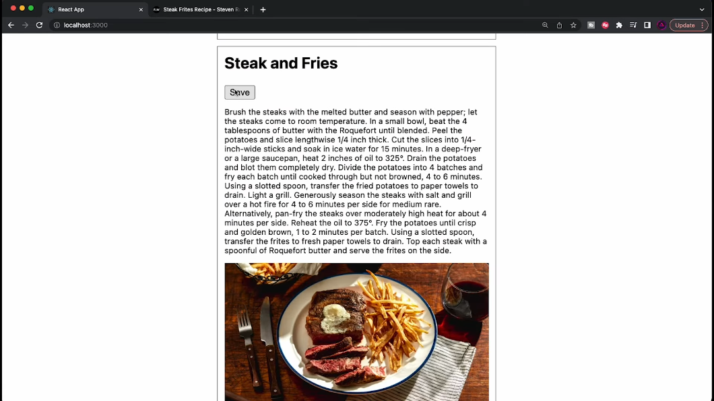

# Recipe App with Authentication - Project README

## Overview

Welcome to the Recipe App with Authentication project! This project is a result of a comprehensive tutorial provided by the owner, guiding viewers through the process of building a MERN stack recipe app with authentication. The tutorial covers everything from backend setup to front-end implementation, including user authentication and authorization.

## Features

- **User Authentication:** Users can register and log in securely using hashed passwords.
- **Recipe Management:** Users can create, save, and retrieve recipes.
- **Front-end UI:** The project includes a well-designed and functional user interface built with React.

## Technologies Used

- **Bcrypt:**
  - Used for hashing passwords to ensure secure storage and authentication.

- **Cors:**
  - Enables cross-origin resource sharing, providing a sensible flow and support for communication between the front-end and back-end.

- **Jwt:**
  - Handles authentication by generating JSON Web Tokens, allowing secure user sessions.

- **Nodemon:**
  - Facilitates automatic server restarts upon code changes during development, enhancing the development workflow.

- **Mongoose:**
  - An ODM (Object Data Modeling) library for MongoDB and Node.js, simplifying interactions with the MongoDB database.

- **MongoDB:**
  - A NoSQL database used to store recipe and user data efficiently.

- **ExpressJS:**
  - A web application framework for Node.js, providing a robust set of features for building web and mobile applications.

- **ReactJS:**
  - A JavaScript library for building user interfaces, used to create the interactive and responsive front-end of the recipe app.

- **NodeJS:**
  - A JavaScript runtime environment that executes server-side code, powering the back-end of the MERN stack.

## Getting Started

Follow these steps to set up and run the project locally:

1. **Clone the Repository:**
   ```bash
   git clone https://github.com/atomicno28/Recipe-App.git

2. **Server Setup:**

- Navigate to the server directory.
- Install dependencies: `npm install`
- Set up your MongoDB connection in the `config/db.js` file.
- Run the server: `npm start`

3. **Client Setup:**
- Navigate to the client directory.
- Install dependencies: `npm install`
- Start the React app: `npm start`

**Explore the App:**

Open your browser and go to `http://localhost:3000` to access the app.

### Screenshots

- Home Page



- Login/Registration Page



- Registration Done



- Login Done



Dashboard containing Saved Recipes



- Create Recipe Option



- Adding Details to the form



- Recipe Created



- Added Recipe Shown



### Additional Information

For any issues or suggestions, please open an issue.
Feel free to contribute to the project by submitting a pull request.
Happy coding and cooking! 🍲👩‍🍳👨‍🍳